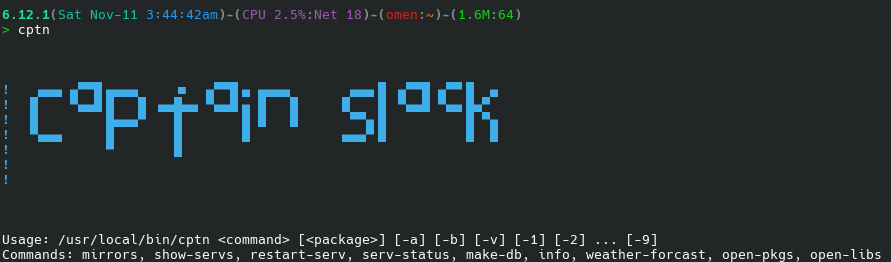

# Captain-Slack (cptn)

> We're living the future so the present is our past.

---

## Install

- required:`yq` and `jq`, from SBo
* Download source.tar.gz from release or from branches.
- extract tarball and change in folder.
* As root ran `bash cptn.SlackBuild`
- Finally `upgradepkg --install-new /tmp/cptn*.tlz`

Alternative method (unstable):
1. `git clone https://github.com/rizitis/captain-slack.git`
2. `cd captain-slack && sudo bash cptn.SlackBuild`
3. `sudo upgradepkg --install-new /tmp/cptn*.tlz`
4. `sudo rm /tmp/cptn*.tlz`
 

### Uninstall

As root `removepkg cptn`

--- 

### Usage:

**create db**

1. `cptn make-db -a` (as root) Will create a full database of all installed packages and libraries (need some time...)
2. `cptn make-db -p` (as root) The same but only for packages
3. `cptn make-db -l` (as root) The same but only for libraries and their deps...

---
**print infos**
1. `cptn info package-name` Will print info for the package
2. `cptn info package-name` the same if its a library
3. `cptn open-libs` or `cptn open-pkgs` Defauld text editor will open with  the yaml file for installed libraries or packages

---

**services**

4. `cptn serv-status rc.service-name` (as root) Will print service status info
5. `cptn restart-serv`   (as root) Will print all rc.services and ask use to chose which need restart
6. `cptn show-servs` (as root) Will export in terminal all services and their status.

---

**mirrors and weather forcast**

7. `cptn find-mirror` Will check all active slackware mirrorlist servers and print top 5 faster for your location.
8. `cptn weather-forcast` Will print in terminal next days weather forcast for you :D *(assume you are not under vpn)*
---

#### Videos:
https://asciinema.org/a/5uULLvA12w3Yj69HrEqh9CNPK  
https://asciinema.org/a/CBgyGtqAuDwLphHhnbZubQAzq

---

#### TODO
`cptn make coffee`

