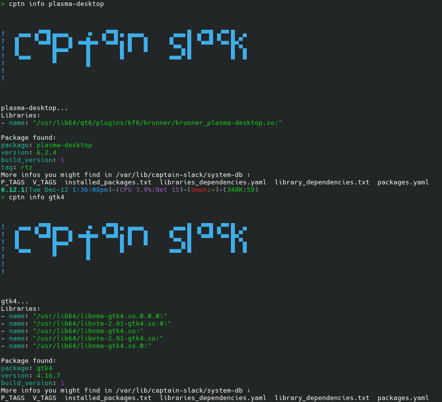
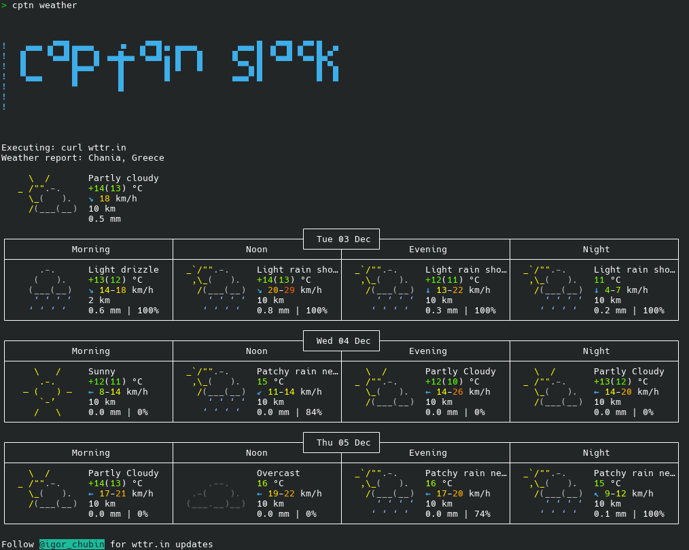

# Captain-Slack (cptn)

> We're living the future so the present is our past.

---

## Install

- required:`yq`, `chafa` and `jq`, from SBo
* DO NOT Download source.tar.gz from release it will not work. Please Download *zip* file from latest branch.
- Unzip zip file and change in folder.
* As root run `bash cptn.SlackBuild`
- Finally `upgradepkg --install-new /tmp/cptn*.tlz`

Alternative method (unstable):
1. `git clone https://github.com/rizitis/captain-slack.git`
2. `cd captain-slack && sudo bash cptn.SlackBuild`
3. `sudo upgradepkg --install-new /tmp/cptn*.tlz`
4. `sudo rm /tmp/cptn*.tlz`

**NOTE:** main README.md as main branch it self, is the develop branch. 
  Some informations or commands may not exist yet for latest cptn release zip files. 
Please read **release version branch README.md** for valid infos.

---

### Uninstall

As root `removepkg cptn`

--- 

### Usage:

If you install Captain-Slack the first thing you must do is create data-base for packages and libraries:

**create db**

1. `cptn make-db -a` (as root) Will create a full database of all installed packages and libraries (need some time...)
2. `cptn make-db -p` (as root) The same but only for packages
3. `cptn make-db -l` (as root) The same but only for libraries and their deps...

---
For print informations about your current system use:

**print infos**
1. `cptn info <package-name>` Will print info for the package
2. `cptn info <package-name>` the same if its a library (the **.so** extension not needed)
3. `cptn open-libs` or `cptn open-pkgs` Defauld text editor will open  the yaml file for installed libraries or packages (only for read)
3. `cptn open-logs` Default file manager will open /var/log/captain-slack folder for read files.
---
To print informations about running services or status of a services or restart a service:

**services**

1. `cptn serv-status <rc.service-name>` (as root) Will print service status info
2. `cptn restart-serv`   (as root) Will print all rc.services and ask use to chose which need restart
3. `cptn show-servs` (as root) Will export in terminal all services and their status.

---
To find and use fast mirrors as for your location from mirrorlist:

**mirrors and weather forcast**

1. `cptn mirrors` (as root) Will check all active slackware mirrorlist servers and print top 5 (default) faster for your location.
   - `cptn mirrors -1` Using flag `-1` will print only the faster
   - `cptn mirrors -[1..9]` Valid flags numbers are from 1 to 9. (if not -N flag set, then default is top 5 mirrors)
2. `cptn weather` Will print in terminal next days weather forcast for you :D *(assume you are not under vpn)*
---

#### Videos:
https://asciinema.org/a/5uULLvA12w3Yj69HrEqh9CNPK  
https://asciinema.org/a/CBgyGtqAuDwLphHhnbZubQAzq

---

#### ScreenShots

---

---

#### Examples.yaml
1. [libraries](./libraries_dependencies.yaml)
2. [packages](./packages.yaml)

#### TODO
- `cptn make coffee`
- `fix bugs`

